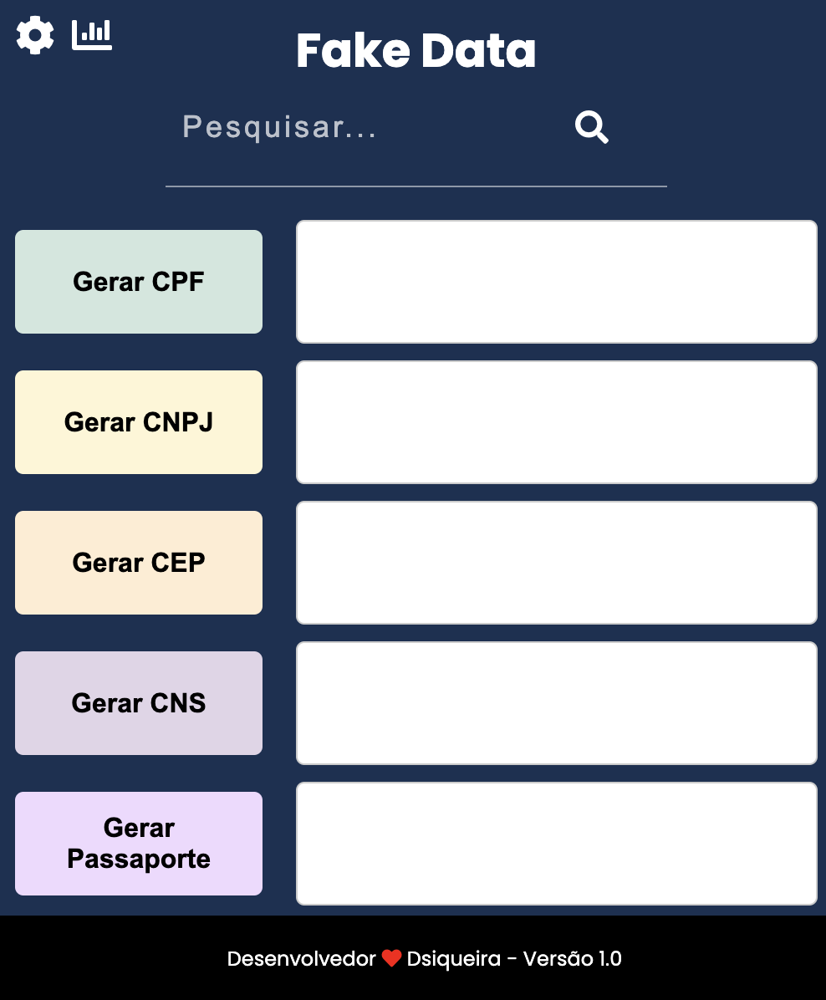

# 🚀 Fake Data Generator - Extensão Chrome

[](https://github.com/dssiqueira/FakeData)
[](https://opensource.org/licenses/MIT)
[](https://github.com/dssiqueira)
[](https://github.com/dssiqueira/FakeData)
[](https://github.com/dssiqueira/FakeData/pulls)
[](https://github.com/dssiqueira/FakeData/graphs/commit-activity)

<div align="center">
  
  
  
</div>

## ⚠️ Aviso Legal Importante

> Esta extensão é uma ferramenta desenvolvida **EXCLUSIVAMENTE** para fins de teste e desenvolvimento de software. Não possui qualquer finalidade comercial ou fraudulenta.
>
> - ✅ Utiliza apenas algoritmos e dados públicos disponíveis abertamente na internet
> - ✅ Não armazena ou transmite dados pessoais
> - ✅ Em conformidade com a LGPD (Lei Geral de Proteção de Dados)
> - ❌ NÃO deve ser utilizada para fins fraudulentos ou comerciais

## 📋 Sobre o Projeto

Esta extensão foi desenvolvida para auxiliar desenvolvedores e testadores a gerarem dados válidos para seus projetos de forma simples e rápida. É uma ferramenta essencial para testes de software, permitindo a geração de dados que respeitam as regras de validação brasileiras.

## ✨ Funcionalidades

### 📑 Documentos de Pessoa Física
- **CPF** (Cadastro de Pessoas Físicas)
- **RG** (Registro Geral)
- **CNH** (Carteira Nacional de Habilitação)
- **Título de Eleitor**
- **PIS** (Programa de Integração Social)
- **CTPS** (Carteira de Trabalho e Previdência Social)
- **NIT** (Número de Identificação do Trabalhador)
- **CNS** (Cartão Nacional de Saúde)
- **CAM** (Certificado de Alistamento Militar)
- **Passaporte**
- **CEP** (Código de Endereçamento Postal)

### 🏢 Documentos de Pessoa Jurídica
- **CNPJ** (Cadastro Nacional da Pessoa Jurídica)
- **IE** (Inscrição Estadual)

### 🚗 Documentos de Veículos
- **CRLV** (Certificado de Registro e Licenciamento de Veículo)

### ⚡ Recursos Adicionais
- Interface intuitiva e responsiva
- Busca rápida de documentos
- Opção de copiar com ou sem máscara
- Visualização de CEP no mapa
- Consulta de dados de CNPJ
- Estatísticas de uso

## ⚙️ Instalação

1. Clone este repositório:
    ```bash
    git clone https://github.com/dssiqueira/FakeData.git
    ```
2. Abra o Chrome e acesse `chrome://extensions/`
3. Ative o **Modo do desenvolvedor** no canto superior direito
4. Clique em **Carregar sem compactação** e selecione a pasta do projeto clonado

## 🖱️ Como Usar

1. Clique no ícone da extensão na barra de ferramentas do Chrome
2. Escolha o tipo de dado que deseja gerar
3. O dado será gerado automaticamente
4. Use os botões disponíveis para copiar ou formatar o dado gerado

## 🤝 Contribuição

Contribuições são bem-vindas! Se você tem sugestões ou encontrou algum bug:

1. Faça um fork do projeto
2. Crie uma branch para sua feature (`git checkout -b feature/MinhaFeature`)
3. Faça commit das mudanças (`git commit -m 'Adiciona nova feature'`)
4. Faça push para a branch (`git push origin feature/MinhaFeature`)
5. Abra um Pull Request

## 📜 Licença

Este projeto está licenciado sob a licença MIT - veja o arquivo [LICENSE](LICENSE) para detalhes.

## 📧 Contato

Desenvolvido com ❤️ por [Dsiqueira](https://github.com/dssiqueira) - Versão 1.0

---

**Lembre-se**: Esta ferramenta deve ser utilizada apenas para fins de desenvolvimento e testes de software.
